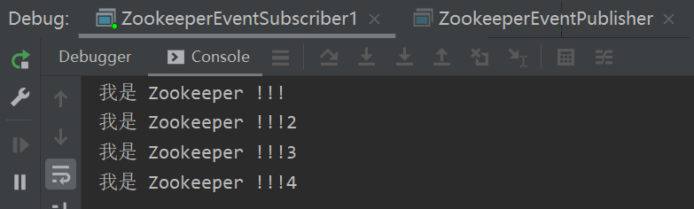
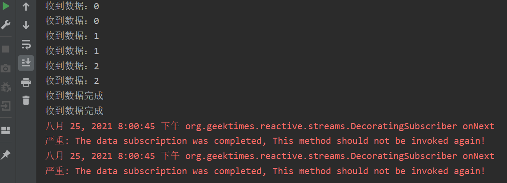
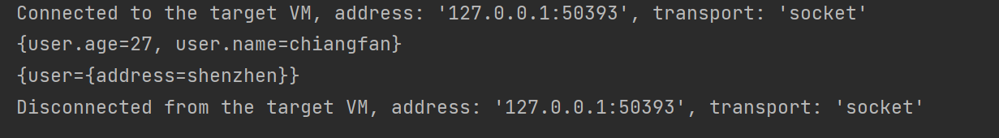
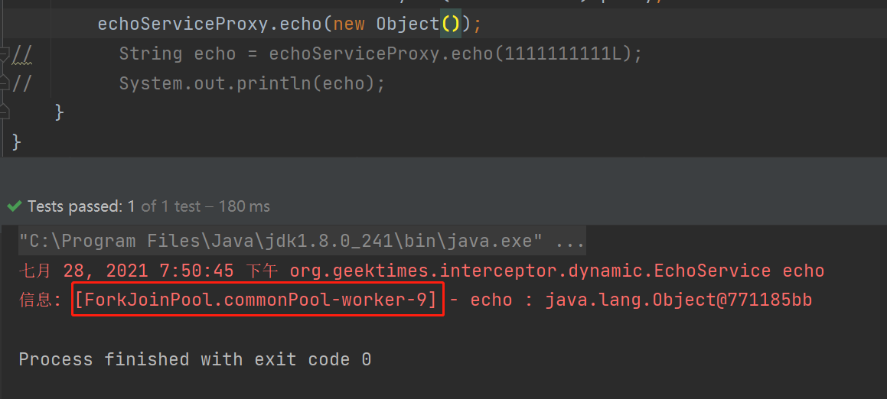
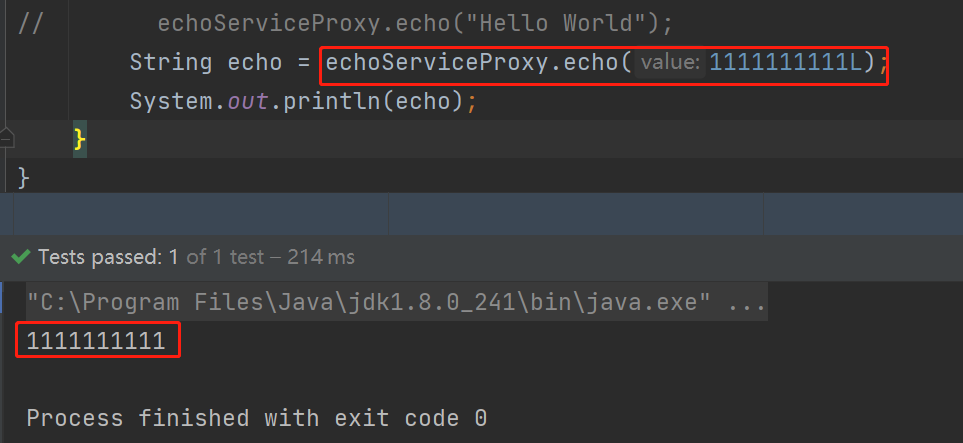
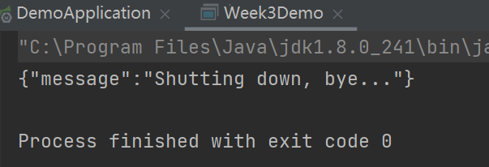

# 极客事件小马哥 P7 课程 作业工程

## WEEK 9 作业路径
1. 新建 `org.geektimes.event.distributed.zookeeper.ZookeeperEventPublisher` 生产者，用于生产消息。
   * 在构造方法中声明 zk 的地址，以及需要监听的 topic 名称
   * 初始化时，调用 `initBuildInSub` 用于初始化内建的消费者。该消费者监听到消息后，将消息写到 zk 中。
   * 在 `org.geektimes.event.distributed.zookeeper.ZookeeperEventPublisher.main` 中调用 publish 方法发送消息
   
2. 新建 `org.geektimes.event.distributed.zookeeper.ZookeeperEventSubscriber` 消费者，用于消费消息
   * 在构造方法中声明 zk 的地址，以及需要消费的 topic 名称
   * 调用 `initBuildInPub` 用于初始化内建的生产者。该生产者监听 zk 节点的数据变化，当 zk 节点有数据变化时
     通过 `simplePublisher.publish` 发送本地消息。
   * 在 `org.geektimes.event.distributed.zookeeper.ZookeeperEventSubscriber.main` 中调用 `onSubscriber` 来对消息进行监听
   
3. 效果：
   

## WEEK 8 作业路径
1. 新建 `org.geektimes.reactive.reactor.WEEK8` 测试类，用于测试 Mono API
2. `org.geektimes.reactive.reactor.WEEK8.demoMonoPublisher` 方法中
   * 使用 `Mono.fromDirect` 获取 Mono 对象，并调用 subscribe 方法监听 SimplePublisher 的内容更新。
   * 使用 `Flux.from` 获取 Flux 对象，并调用 flux.subscribe 方法监听 SimplePublisher 的内容更新。
   
3. 测试结果：
   测试发现，在 BusinessSubscriber 中的 onNext 方法，分别被调用了两次，说明 `Mono.fromDirect`
   及 `Flux.from` 均可以让 BusinessSubscriber 实时获取到 publisher 中发送的数据。
   

## WEEK7 作业路径
1. `@Validated` 的工作原理。查看 `@Validated` 注解的声明，其注释显示，实现类为 `org.springframework.validation.beanvalidation.SpringValidatorAdapter`;
   * 查看 `org.springframework.validation.beanvalidation.SpringValidatorAdapter.validate(java.lang.Object, org.springframework.validation.Errors)` 方法，
   该方法的调用方之一有 `org.springframework.validation.DataBinder.validate(java.lang.Object...)`, 而这个 validate 方法是由
     `org.springframework.web.method.annotation.ModelAttributeMethodProcessor.validateIfApplicable` 调用。`validateIfApplicable` 的 `determineValidationHints` 方法中解析了
     `@Validated` 注解及 `startsWith("Valid")` 名称的注解。获取注解的 value 字段，然后交由 DataBinder 处理。
      
   * 在 `org.springframework.validation.beanvalidation.SpringValidatorAdapter.processConstraintViolations` 方法中，根据入参的 `violation` 分别对参数进行校验。
      这里的 `violation` 可选实现有 `org.hibernate.validator.internal.engine.ConstraintViolationImpl` 也就是又交给 hibernate 或者 JSR 303 处理。
     
   * 方法标注上的注解类似，`org.springframework.validation.beanvalidation.MethodValidationInterceptor` 获取方法上标注的 `@Validated` 注解后。
     调用 `javax.validation.executable.ExecutableValidator.validateParameters` JSR 的接口完成参数校验。
   * 总结一下，Spring `@Validated` 注解通过切面或者 `Interceptor` 的方式，获取到需要校验的内容后，还是交由 JSR303 或者 hibernate 的实现来进行处理。
   
2. `@Validated` 注解与 Spring Validator 以及 JSR-303 Bean Validation @javax.validation.Valid 之间的关系
   * `@Validated` 仅作为一个注解，其内部逻辑的实现需要依靠 `Validator`.
      * 不过在 Spring Validator 的实现中，一般将 JSR-303 Bean Validation 作为 delegate 。如：`org.springframework.validation.beanvalidation.SpringValidatorAdapter.targetValidator`。用于实现 JSR-303 中的规范。
   

## WEEK6 作业路径
1. 新建 `org.geektimes.configuration.microprofile.config.annotation.ConfigSources` 注解，注解成员为 ConfigSource 的数组对象。

2. 修改 `org.geektimes.configuration.microprofile.config.annotation.ConfigSource` 注解，增加 `@Repeatable(ConfigSources.class)` 的标注。

3. 新建 `sun.net.www.protocol.filepath.Handler` 已实现 filePath 协议的解析。其中通过协议 resource 定义的 file 文件路径，返回对应的 `fileInputStream`.

4. 新建 `org.geektimes.configuration.microprofile.config.annotation.YamlConfigSourceFactory` 实现 `ConfigSourceFactory` 接口用于完成 yaml 类型格式的配置解析。

5. 新建 `org.geektimes.configuration.microprofile.config.annotation.Week6Test` 用于作业的测试。
   * 在类名上标注一个不指定 ConfigSourceFactory 的注解：`@ConfigSource(ordinal = 200, resource = "filepath:D:\\chiangfan\\Workspace\\Learn\\小马哥 P7\\Project\\config\\test.properties")`
   * 标注在一个指定 `YamlConfigSourceFactory` 的注解：`@ConfigSource(ordinal = 200, resource = "filepath:D:\\chiangfan\\Workspace\\Learn\\小马哥 P7\\Project\\config\\test.yaml",
     factory = YamlConfigSourceFactory.class)`
     
   * 修改测试类中的 initConfigSourceFactory 方法，解析 ConfigSource 类型注解的数组。
   * 执行 test 方法。可以看到，properties 的文件以及 yaml 格式的文件都正常解析并加载到了 configSource 中:
   
     
6. @Repeatable 的实现原理: 
   * 在 `org.geektimes.configuration.microprofile.config.annotation.Week6Test.initConfigSourceFactory` 中通过 `getClass().getAnnotationsByType(ConfigSource.class)` 获取到了所有的 `ConfigSource`.
   * 从 `getAnnotationsByType` 入手。跟踪到 `sun.reflect.annotation.AnnotationSupport.getDirectlyAndIndirectlyPresent`
   * 在 `sun.reflect.annotation.AnnotationSupport.getIndirectlyPresent` 中看到对 Repeatable 做了处理
      ```java
        private static <A extends Annotation> A[] getIndirectlyPresent(Map<Class<? extends Annotation>, Annotation> var0, Class<A> var1) {
        Repeatable var2 = (Repeatable)var1.getDeclaredAnnotation(Repeatable.class);
        if (var2 == null) {
            return null;
        } else {
            Class var3 = var2.value();
            Annotation var4 = (Annotation)var0.get(var3);
            if (var4 == null) {
                return null;
            } else {
                Annotation[] var5 = getValueArray(var4);
                checkTypes(var5, var4, var1);
                return var5;
            }
        }
      }
      ```
     
   * 在 `Annotation[] var5 = getValueArray(var4);` 方法中，通过 Repeatable 的 value，也就是 ConfigSources 注解。通过反射，执行 ConfigSources 的 value() 方法，并返回。
   
## WEEK5 作业路径
1. 新建 `org.geektimes.cache.annotation.interceptor.CacheRemoveInterceptor` 
   继承 `org.geektimes.cache.annotation.interceptor.CacheOperationInterceptor` 抽象类。
   
2. 因为 `org.geektimes.cache.annotation.interceptor.CacheOperationInterceptor` 中实现了调用的模板。
   所以主要实现 `org.geektimes.cache.annotation.interceptor.CacheRemoveInterceptor` 中的 `beforeExecute` 及 `afterExecute` 方法。
   
3. 在 `afterExecute` 方法中使用 cache 的方法，删除对应的缓存。

4. 新增 `org.geektimes.cache.week5.Week5Test` 测试类，用于测试缓存删除的效果。
5. 作业思路: 新建一个用于处理 `@CacheRemove` 的 `Interceptor`, 根据方法上的 `@CacheRemove` 注解。
   获取一个对应的缓存对象 `Cache`，根据语义对 cache 中的内容做操作。完成 `Interceptor` 后，使用上周作业完成的 `enhancer` 
   对 `org.geektimes.cache.week5.DataRepository` 做增强，使该接口中的所有方法都会经过 `Interceptor`。

## WEEK4 作业路径
1. 新建 `org.geektimes.interceptor.dynamic.InvocationHandlerAdapter` 实现 JDK 动态代理 
   `java.lang.reflect.InvocationHandler` 接口。并实现其中的 `invoke()` 方法。
   
2. `InvocationHandlerAdapter#invoke` 方法中新建 `InvocationHandlerContext` 实例作为 
   `ChainableInvocationContext` 的入参，并返回 `context.proceed()` 方法的执行。
   
3. 实现 `org.geektimes.interceptor.dynamic.InterceptorDynamicEnhancer` 类中的 `enhance()` 方法，
   返回入参 target 的一个代理类。
   
4. 新增 `org.geektimes.interceptor.dynamic.IEchoService` 接口，用于提供服务。
5. 完成测试用例：`org.geektimes.interceptor.dynamic.Week4Test`。
   * 调用 echo(Object) 方法时，看到控制台打印的线程不为 main 线程，说明 `@Asynchronous` 使用生效。
   
   * 调用 echo(Long) 方法时，看到控制台有打印入参。该方法没有返回 `UnsupportedOperationException` 说明 `@Fallback` 使用生效。
   
     
## WEEK3 作业路径
1. 新建 `org.geektimes.rest.client.HttpPostInvocation` 类并实现 `javax.ws.rs.client.Invocation`。
实现主要方法 `invoke()` 增加 POST 方法的参数处理。

2. 修改 `org.geektimes.rest.client.DefaultInvocationBuilder.buildPost` 方法，该方法返回 1 中的 `HttpPostInvocation` 实例。

3. 在 week1 中的 demo 工程中，开放对应的 actuator endpoint。并新增 `org.geektime.week1.controller.EchoServiceController` 
   提供 echo 方法。
   
4. 新增 `org.geektimes.microprofile.rest.Week3Demo` 测试类，分别对其中的 `ActuatorService` 及 `EchoService` 进行调用。
调用情况：
   
   
   
*注：前两次作业的 README 在子工程内*
