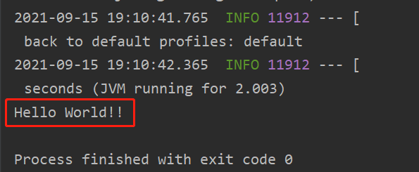

# 极客事件小马哥 P7 课程 作业工程

## WEEK 12 作业路径
说明 Spring Cloud Alibaba Nacos 服务注册和发现的逻辑
1. DiscoveryClient 实现
   * 在 `spring-cloud-starter-alibaba-nacos-discovery` 的 META-INF/spring.factories 中声明了一些 nacos 相关的自动装配
   ```properties
   org.springframework.boot.autoconfigure.EnableAutoConfiguration=\
   com.alibaba.cloud.nacos.discovery.NacosDiscoveryAutoConfiguration,\
   com.alibaba.cloud.nacos.endpoint.NacosDiscoveryEndpointAutoConfiguration,\
   com.alibaba.cloud.nacos.registry.NacosServiceRegistryAutoConfiguration,\
   com.alibaba.cloud.nacos.discovery.NacosDiscoveryClientConfiguration
   ```
   * 其中 `NacosDiscoveryClientConfiguration` 中声明了 `DiscoveryClient nacosDiscoveryClient` bean;
   * `NacosDiscoveryClient` 实现了 `DiscoveryClient` 并复写了 `getInstances` 及 `getServices` 方法。
   * 以 `getServices` 为例，`getServices` 的实现其实直接调用了 `namingService().getServicesOfServer` 而 namingService 可以看做是 nacos 服务器调用的一些封装。
   其内部通过 http 请求 nacosServer 暴露的 API 并将结果返回。
   * 如此便实现了从 nacosServer 获取服务注册的信息。
2. ServiceRegistration 实现
   * 在 `spring-cloud-starter-alibaba-nacos-discovery` 的 META-INF/spring.factories 中有一个
     `NacosServiceRegistryAutoConfiguration` 的自动装配 
   * 在 `NacosServiceRegistryAutoConfiguration` 声明了 `NacosAutoServiceRegistration nacosAutoServiceRegistration`
   * `NacosAutoServiceRegistration#register` 方法中，确认注册的开关及端口，调用 super.register();
   * super.register() 会调用构造方法中传入的 serviceRegistry.register();
   * 而在 NacosServiceRegistry#register 方法中，其实也是获取服务 id，group 然后通过 namingServer 调用 nacosServer 的 API 将服务注册到 nacos 中
   
3. 自动装配
   * 在 `spring-cloud-starter-alibaba-nacos-discovery` 的 META-INF/spring.factories 中声明了一些 nacos 相关的自动装配
   * 使用 `EnableDiscoveryClient` 注解时，会开启服务发现。
   * 而 `NacosDiscoveryClientConfiguration` 及 `NacosServiceRegistryAutoConfiguration` 均具有条件装配注解 `ConditionalOnNacosDiscoveryEnabled`。
   * `NacosDiscoveryClientConfiguration` 同时具备 `ConditionalOnDiscoveryEnabled` 条件注解。
   * 通过`EnableDiscoveryClient` 控制加载 `NacosDiscoveryClientConfiguration` 及 `NacosServiceRegistryAutoConfiguration` 完成自动装配

## WEEK 11 作业路径
1. 新建 `notweb-spring-boot-starter` 项目
* 新建 `org.geektime.spring.boot.starter.configure. `
配置类，并在其中声明一个 `ApplicationRunner` 的 bean
* 在改项目中新建一个 `META-INF/spring.factories`, 将上一步新建的 `NotWebApplicationRunnerConfiguration` 作为 spring-boot autoconfiguration 的实现
2. 新建 `spring-boot-starter-demo` 用于测试
* pom 中依赖 notweb-spring-boot-starter 
* 编写 `org.geektime.spring.boot.starter.demo.Application`
* 执行 `org.geektime.spring.boot.starter.demo.Application.main` 方法，并以非 web 方式启动。
3. 执行结果：按预期输出了 NotWebApplicationRunnerConfiguration 中的内容。

   

## WEEK 10 作业路径
1. 搭建正常的 dubbo demo 应用
   * 新建 dubbo-provider-demo 用于构建服务提供者
   * 新增 `org.geektimes.project.week10.provider.service.IEchoService` 实现服务提供方的接口
   * 启动服务提供者 `org.geektimes.project.week10.provider.Application`
   * 新建 dubbo-consumer-demo 用于构建服务消费者
   * 新增 `org.geektimes.project.week10.provider.service.IEchoService` 用于调用服务提供方的服务
   * 启动服务消费者 `org.geektimes.project.week10.consumer.Application`
   
2. 增加 dubbo filter - `org.geektimes.project.week10.bulkhead.BulkheadR4jFilter`
   * 该过滤器中，主要获取经过的方法，判断方法上是否存在 `@org.geektimes.project.week10.bulkhead.Bulkhead` 注解。
   * 如果不存在对应注解，则认为无需开启限流，直接执行 invoker.invoke 跳过该过滤器
   * 如果存在对应注解，则根据注解的字段。生成对应的 R4j Bulkhead 对象。
   * 调用 invoker.invoke 前注入 R4j Bulkhead 对象实现限流的功能
   
3. 新建 `src/main/resources/META-INF/dubbo/org.apache.dubbo.rpc.filter` 文件，用于在 SPI 声明自定义的 BulkheadR4jFilter 

## WEEK 9 作业路径
1. 新建 `org.geektimes.event.distributed.zookeeper.ZookeeperEventPublisher` 生产者，用于生产消息。
   * 在构造方法中声明 zk 的地址，以及需要监听的 topic 名称
   * 初始化时，调用 `initBuildInSub` 用于初始化内建的消费者。该消费者监听到消息后，将消息写到 zk 中。
   * 在 `org.geektimes.event.distributed.zookeeper.ZookeeperEventPublisher.main` 中调用 publish 方法发送消息
   
2. 新建 `org.geektimes.event.distributed.zookeeper.ZookeeperEventSubscriber` 消费者，用于消费消息
   * 在构造方法中声明 zk 的地址，以及需要消费的 topic 名称
   * 调用 `initBuildInPub` 用于初始化内建的生产者。该生产者监听 zk 节点的数据变化，当 zk 节点有数据变化时
     通过 `simplePublisher.publish` 发送本地消息。
   * 在 `org.geektimes.event.distributed.zookeeper.ZookeeperEventSubscriber.main` 中调用 `onSubscriber` 来对消息进行监听
   
3. 效果：
   

## WEEK 8 作业路径
1. 新建 `org.geektimes.reactive.reactor.WEEK8` 测试类，用于测试 Mono API
2. `org.geektimes.reactive.reactor.WEEK8.demoMonoPublisher` 方法中
   * 使用 `Mono.fromDirect` 获取 Mono 对象，并调用 subscribe 方法监听 SimplePublisher 的内容更新。
   * 使用 `Flux.from` 获取 Flux 对象，并调用 flux.subscribe 方法监听 SimplePublisher 的内容更新。
   
3. 测试结果：
   测试发现，在 BusinessSubscriber 中的 onNext 方法，分别被调用了两次，说明 `Mono.fromDirect`
   及 `Flux.from` 均可以让 BusinessSubscriber 实时获取到 publisher 中发送的数据。
   

## WEEK7 作业路径
1. `@Validated` 的工作原理。查看 `@Validated` 注解的声明，其注释显示，实现类为 `org.springframework.validation.beanvalidation.SpringValidatorAdapter`;
   * 查看 `org.springframework.validation.beanvalidation.SpringValidatorAdapter.validate(java.lang.Object, org.springframework.validation.Errors)` 方法，
   该方法的调用方之一有 `org.springframework.validation.DataBinder.validate(java.lang.Object...)`, 而这个 validate 方法是由
     `org.springframework.web.method.annotation.ModelAttributeMethodProcessor.validateIfApplicable` 调用。`validateIfApplicable` 的 `determineValidationHints` 方法中解析了
     `@Validated` 注解及 `startsWith("Valid")` 名称的注解。获取注解的 value 字段，然后交由 DataBinder 处理。
      
   * 在 `org.springframework.validation.beanvalidation.SpringValidatorAdapter.processConstraintViolations` 方法中，根据入参的 `violation` 分别对参数进行校验。
      这里的 `violation` 可选实现有 `org.hibernate.validator.internal.engine.ConstraintViolationImpl` 也就是又交给 hibernate 或者 JSR 303 处理。
     
   * 方法标注上的注解类似，`org.springframework.validation.beanvalidation.MethodValidationInterceptor` 获取方法上标注的 `@Validated` 注解后。
     调用 `javax.validation.executable.ExecutableValidator.validateParameters` JSR 的接口完成参数校验。
   * 总结一下，Spring `@Validated` 注解通过切面或者 `Interceptor` 的方式，获取到需要校验的内容后，还是交由 JSR303 或者 hibernate 的实现来进行处理。
   
2. `@Validated` 注解与 Spring Validator 以及 JSR-303 Bean Validation @javax.validation.Valid 之间的关系
   * `@Validated` 仅作为一个注解，其内部逻辑的实现需要依靠 `Validator`.
      * 不过在 Spring Validator 的实现中，一般将 JSR-303 Bean Validation 作为 delegate 。如：`org.springframework.validation.beanvalidation.SpringValidatorAdapter.targetValidator`。用于实现 JSR-303 中的规范。
   

## WEEK6 作业路径
1. 新建 `org.geektimes.configuration.microprofile.config.annotation.ConfigSources` 注解，注解成员为 ConfigSource 的数组对象。

2. 修改 `org.geektimes.configuration.microprofile.config.annotation.ConfigSource` 注解，增加 `@Repeatable(ConfigSources.class)` 的标注。

3. 新建 `sun.net.www.protocol.filepath.Handler` 已实现 filePath 协议的解析。其中通过协议 resource 定义的 file 文件路径，返回对应的 `fileInputStream`.

4. 新建 `org.geektimes.configuration.microprofile.config.annotation.YamlConfigSourceFactory` 实现 `ConfigSourceFactory` 接口用于完成 yaml 类型格式的配置解析。

5. 新建 `org.geektimes.configuration.microprofile.config.annotation.Week6Test` 用于作业的测试。
   * 在类名上标注一个不指定 ConfigSourceFactory 的注解：`@ConfigSource(ordinal = 200, resource = "filepath:D:\\chiangfan\\Workspace\\Learn\\小马哥 P7\\Project\\config\\test.properties")`
   * 标注在一个指定 `YamlConfigSourceFactory` 的注解：`@ConfigSource(ordinal = 200, resource = "filepath:D:\\chiangfan\\Workspace\\Learn\\小马哥 P7\\Project\\config\\test.yaml",
     factory = YamlConfigSourceFactory.class)`
     
   * 修改测试类中的 initConfigSourceFactory 方法，解析 ConfigSource 类型注解的数组。
   * 执行 test 方法。可以看到，properties 的文件以及 yaml 格式的文件都正常解析并加载到了 configSource 中:
   
     
6. @Repeatable 的实现原理: 
   * 在 `org.geektimes.configuration.microprofile.config.annotation.Week6Test.initConfigSourceFactory` 中通过 `getClass().getAnnotationsByType(ConfigSource.class)` 获取到了所有的 `ConfigSource`.
   * 从 `getAnnotationsByType` 入手。跟踪到 `sun.reflect.annotation.AnnotationSupport.getDirectlyAndIndirectlyPresent`
   * 在 `sun.reflect.annotation.AnnotationSupport.getIndirectlyPresent` 中看到对 Repeatable 做了处理
      ```java
        private static <A extends Annotation> A[] getIndirectlyPresent(Map<Class<? extends Annotation>, Annotation> var0, Class<A> var1) {
        Repeatable var2 = (Repeatable)var1.getDeclaredAnnotation(Repeatable.class);
        if (var2 == null) {
            return null;
        } else {
            Class var3 = var2.value();
            Annotation var4 = (Annotation)var0.get(var3);
            if (var4 == null) {
                return null;
            } else {
                Annotation[] var5 = getValueArray(var4);
                checkTypes(var5, var4, var1);
                return var5;
            }
        }
      }
      ```
     
   * 在 `Annotation[] var5 = getValueArray(var4);` 方法中，通过 Repeatable 的 value，也就是 ConfigSources 注解。通过反射，执行 ConfigSources 的 value() 方法，并返回。
   
## WEEK5 作业路径
1. 新建 `org.geektimes.cache.annotation.interceptor.CacheRemoveInterceptor` 
   继承 `org.geektimes.cache.annotation.interceptor.CacheOperationInterceptor` 抽象类。
   
2. 因为 `org.geektimes.cache.annotation.interceptor.CacheOperationInterceptor` 中实现了调用的模板。
   所以主要实现 `org.geektimes.cache.annotation.interceptor.CacheRemoveInterceptor` 中的 `beforeExecute` 及 `afterExecute` 方法。
   
3. 在 `afterExecute` 方法中使用 cache 的方法，删除对应的缓存。

4. 新增 `org.geektimes.cache.week5.Week5Test` 测试类，用于测试缓存删除的效果。
5. 作业思路: 新建一个用于处理 `@CacheRemove` 的 `Interceptor`, 根据方法上的 `@CacheRemove` 注解。
   获取一个对应的缓存对象 `Cache`，根据语义对 cache 中的内容做操作。完成 `Interceptor` 后，使用上周作业完成的 `enhancer` 
   对 `org.geektimes.cache.week5.DataRepository` 做增强，使该接口中的所有方法都会经过 `Interceptor`。

## WEEK4 作业路径
1. 新建 `org.geektimes.interceptor.dynamic.InvocationHandlerAdapter` 实现 JDK 动态代理 
   `java.lang.reflect.InvocationHandler` 接口。并实现其中的 `invoke()` 方法。
   
2. `InvocationHandlerAdapter#invoke` 方法中新建 `InvocationHandlerContext` 实例作为 
   `ChainableInvocationContext` 的入参，并返回 `context.proceed()` 方法的执行。
   
3. 实现 `org.geektimes.interceptor.dynamic.InterceptorDynamicEnhancer` 类中的 `enhance()` 方法，
   返回入参 target 的一个代理类。
   
4. 新增 `org.geektimes.interceptor.dynamic.IEchoService` 接口，用于提供服务。
5. 完成测试用例：`org.geektimes.interceptor.dynamic.Week4Test`。
   * 调用 echo(Object) 方法时，看到控制台打印的线程不为 main 线程，说明 `@Asynchronous` 使用生效。
   
   * 调用 echo(Long) 方法时，看到控制台有打印入参。该方法没有返回 `UnsupportedOperationException` 说明 `@Fallback` 使用生效。
   
     
## WEEK3 作业路径
1. 新建 `org.geektimes.rest.client.HttpPostInvocation` 类并实现 `javax.ws.rs.client.Invocation`。
实现主要方法 `invoke()` 增加 POST 方法的参数处理。

2. 修改 `org.geektimes.rest.client.DefaultInvocationBuilder.buildPost` 方法，该方法返回 1 中的 `HttpPostInvocation` 实例。

3. 在 week1 中的 demo 工程中，开放对应的 actuator endpoint。并新增 `org.geektime.week1.controller.EchoServiceController` 
   提供 echo 方法。
   
4. 新增 `org.geektimes.microprofile.rest.Week3Demo` 测试类，分别对其中的 `ActuatorService` 及 `EchoService` 进行调用。
调用情况：
   
   
   
*注：前两次作业的 README 在子工程内*
