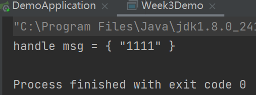

# 极客事件小马哥 P7 课程 作业工程

## WEEK4 作业路径
1. 新建 `org.geektimes.interceptor.dynamic.InvocationHandlerAdapter` 实现 JDK 动态代理 
   `java.lang.reflect.InvocationHandler` 接口。并实现其中的 `invoke()` 方法。
   
2. `InvocationHandlerAdapter#invoke` 方法中新建 `InvocationHandlerContext` 实例作为 
   `ChainableInvocationContext` 的入参，并返回 `context.proceed()` 方法的执行。
   
3. 实现 `org.geektimes.interceptor.dynamic.InterceptorDynamicEnhancer` 类中的 `enhance()` 方法，
   返回入参 target 的一个代理类。
   
4. 新增 `org.geektimes.interceptor.dynamic.IEchoService` 接口，用于提供服务。
5. 完成测试用例：`org.geektimes.interceptor.dynamic.Week4Test`。
   * 调用 echo(Object) 方法时，看到控制台打印的线程不为 main 线程，说明 `@Asynchronous` 使用生效。
   
   * 调用 echo(Long) 方法时，看到控制台有打印入参。该方法没有返回 `UnsupportedOperationException` 说明 `@Fallback` 使用生效。
   
     
## WEEK3 作业路径
1. 新建 `org.geektimes.rest.client.HttpPostInvocation` 类并实现 `javax.ws.rs.client.Invocation`。
实现主要方法 `invoke()` 增加 POST 方法的参数处理。

2. 修改 `org.geektimes.rest.client.DefaultInvocationBuilder.buildPost` 方法，该方法返回 1 中的 `HttpPostInvocation` 实例。

3. 在 week1 中的 demo 工程中，开放对应的 actuator endpoint。并新增 `org.geektime.week1.controller.EchoServiceController` 
   提供 echo 方法。
   
4. 新增 `org.geektimes.microprofile.rest.Week3Demo` 测试类，分别对其中的 `ActuatorService` 及 `EchoService` 进行调用。
调用情况：
   
   
   
*注：前两次作业的 README 在子工程内*
